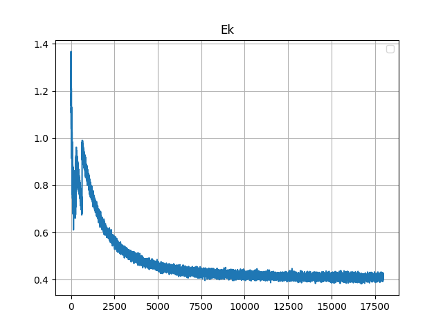
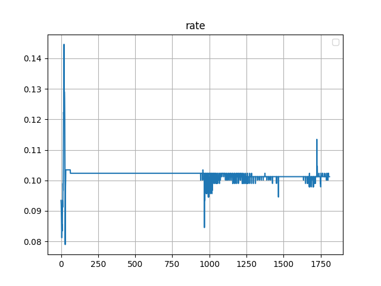
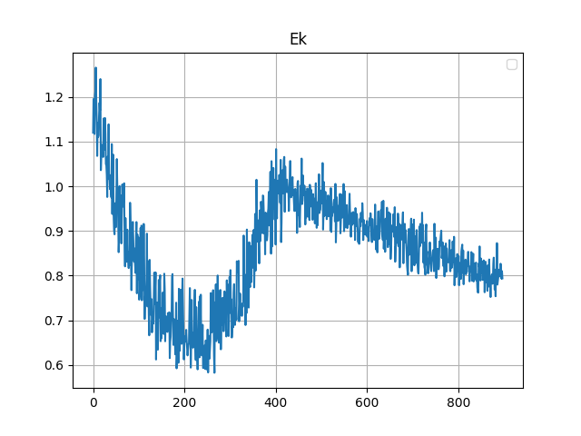
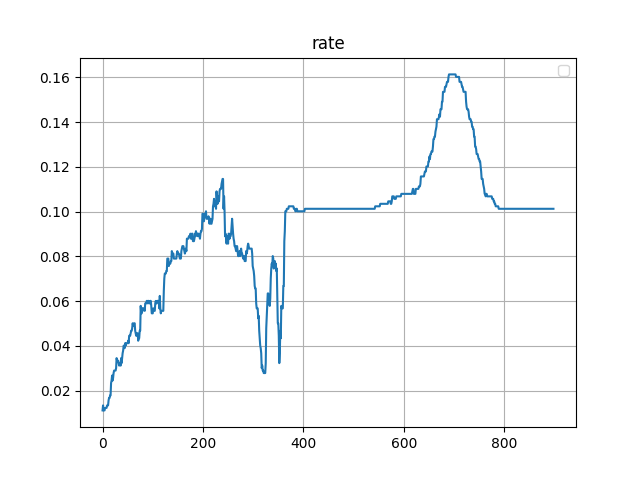
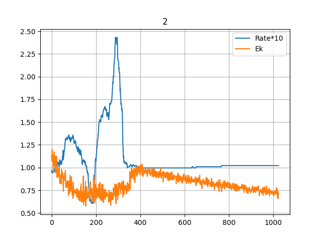

#### 环境搭建

##### Manjaro, Python 3.9

通过 `pip isntall` 命令安装 `numpy` `sklearn` `matplotlib` 等包即可.

#### 复现

数据集为 `sklearn` 中的手写数字识别数据集.

```py
from sklearn import datasets
digits = datasets.load_digits()
```

##### 学习曲线

第一次:





发现命中率先上升后下降, 考虑出现了过拟合, 增加噪声.





增加噪声后发现过拟合出现地较晚, 但仍然出现过拟合.



调整噪声比例后得到相对较好的结果.

##### 性能

单隐层+均方误差+BP算法的神经网络, 性能不如 `SVM` 等算法.

#### 优化

与上次优化 `SVD++` 同样的原理, 通过 `numpy` 的矩阵运算加速.

如

$$
\Delta w_{hj}=\eta g_jb_h
$$

可以这样写:

```py
W = W + np.outer(B, G1)
```

其中 `G1` 为 $\eta$ 和 `G` 的数乘.

`numpy` 底层为 C/C++, 常数比 Python 小很多.
